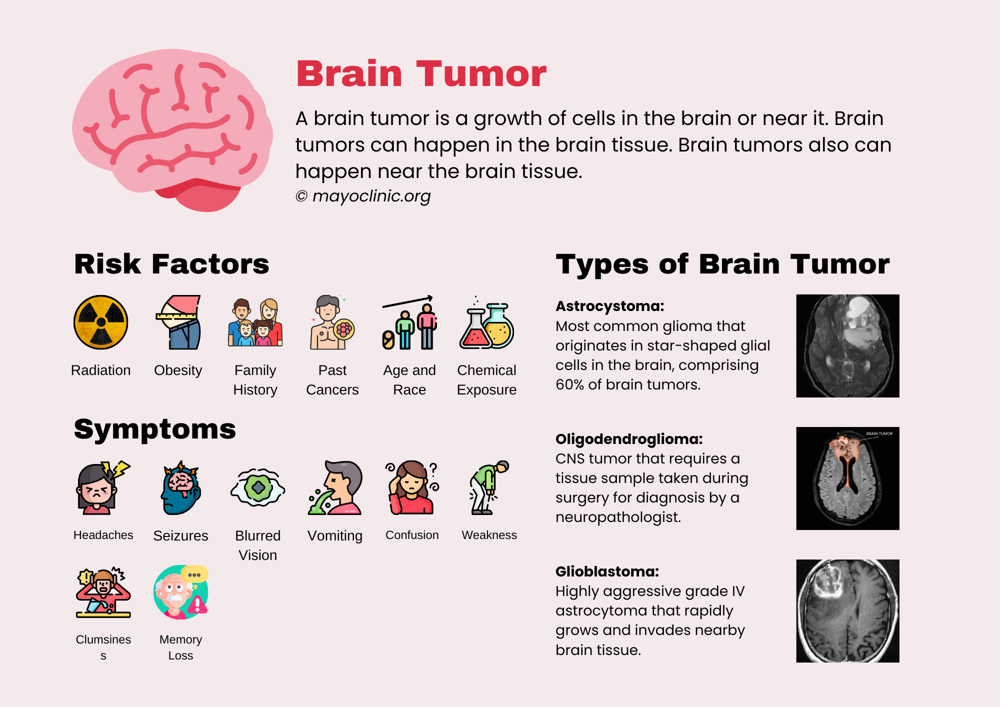
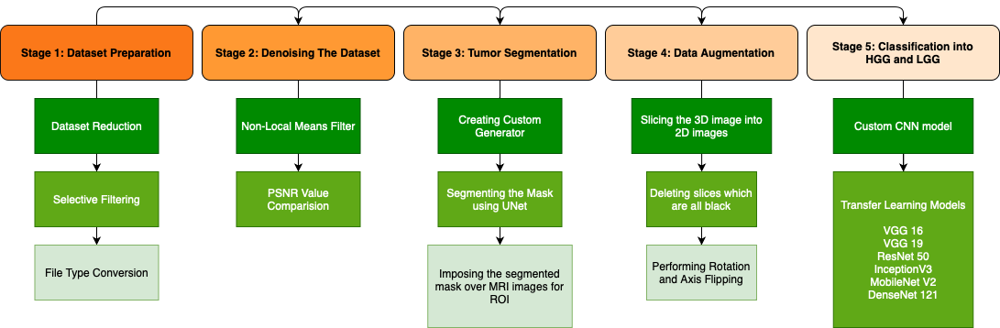

# Glioma Segmentation and Classification by 3D UNets and Autoencoders
Brain tumors can vary widely in their severity, and the prognosis for patients can depend on factors such as the type, size, location, and stage of the tumor, as well as the patient's age and overall health. 

Brain tumors are the leading cause of cancer-related deaths in children under the age of 14 and the second leading cause of cancer-related deaths in people between the ages of 15 and 39. In terms of tumour types among Indians, brain tumours were listed as the 10th most prevalent in 2018. According to the International Association of Cancer Registries (IARC), over 28,000 cases of brain tumours are recorded in India every year, and over 24,000 people are said to die from brain tumours. 

The five-year survival rate for all primary brain and central nervous system tumors is around 36%, but this varies widely depending on the type and stage of the tumor. For example, the five-year survival rate for people with a benign meningioma is around 90%, while the five-year survival rate for people with a glioblastoma multiforme, a particularly aggressive type of brain tumor, is only around 5%.

Glioma, an intricate primary brain neoplasm characterized by formidable malignancy, constitutes a significant healthcare conundrum, representing about 80% of all malignant brain tumors in the adult populace globally. Despite prodigious strides in technology, therapeutics, and research, glioma remains a formidable cause of cancer-associated morbidity and mortality, with patients diagnosed with high-grade gliomas exhibiting an acutely truncated mean survival time of fewer than two years. Glioma grading plays a pivotal role in prognosis, treatment planning, and patient survival. Pre-operative magnetic resonance imaging (MRI) scans provide invaluable insights for glioma grading, including tumor dimensions, location, and morphology. However, precise segmentation and classification of gliomas from MRI scans is a Herculean challenge due to the tumors' complexity and heterogeneity, as well as the variations in imaging protocols and human interpretation. 
  

## Methodology Overview
Given below is a brief overview of the process we took for this project:

## Getting Started
### Dependencies
All the dependencies of this project have been mentioned in `code.ipynb` 

### Executing The Code
You can run the file in Google Colab, Kaggle or Jupyter Notebook.  
**Note:** We used Google Colab Pro for getting extra computing power for training our model for this project. 

## Results 
<table>
<tr>
<th>Model</th>
<th>Accuracy</th>
<th>Val_Accuracy</th>
</tr>
<tr>
<td>VGG16</td>
<td>85.70%</td>
<td>87.12%</td>
</tr>
<tr>
<td>VGG16</td>
<td>80.35%</td>
<td>81.90%</td>
</tr>
<tr>
<td>ResNet50</td>
<td>65.67%</td>
<td>65.75%</td>
</tr>
<tr>
<td>InceptionV3</td>
<td>86.03%</td>
<td>86.08%</td>
</tr>
<tr>
<td>MobileNetV2</td>
<td>93.19%</td>
<td>92.51%</td>
</tr>
<tr>
<td>DenseNet121</td>
<td>86.16%%</td>
<td>88.05%</td>
</tr>
</table>

## Authors
Contributors names and contact info
- Pooja Gera  [@pooja-gera](http://github.com/pooja-gera)
- Gaurisha R. Srivastava
[@Gaurisha21](http://github.com/Gaurisha21)
